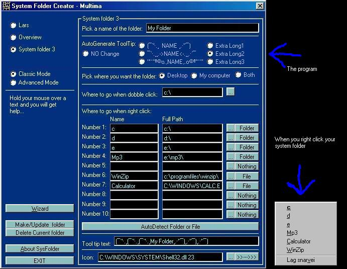



## System Folder Creator

### Description

Make your own system folder very easy. Its difficould to explain. See the screenshot and read the code for more detail's.

See www.duxie.tk for updated program (No source code)
 
### More Info
 

             |
---                |---
**Submitted On**   |2002-07-17 20:47:56
**By**             |[Lars C\. S\.](https://github.com/Planet-Source-Code/PSCIndex/blob/master/ByAuthor/lars-c-s.md)
**Level**          |Beginner
**User Rating**    |4.0 (8 globes from 2 users)
**Compatibility**  |VB 5\.0, VB 6\.0
**Category**       |[Registry](https://github.com/Planet-Source-Code/PSCIndex/blob/master/ByCategory/registry__1-36.md)
**World**          |[Visual Basic](https://github.com/Planet-Source-Code/PSCIndex/blob/master/ByWorld/visual-basic.md)
**Archive File**   |[System\_Fol1073287172002\.zip](https://github.com/Planet-Source-Code/lars-c-s-system-folder-creator__1-36998/archive/master.zip)

### API Declarations

In the code...

